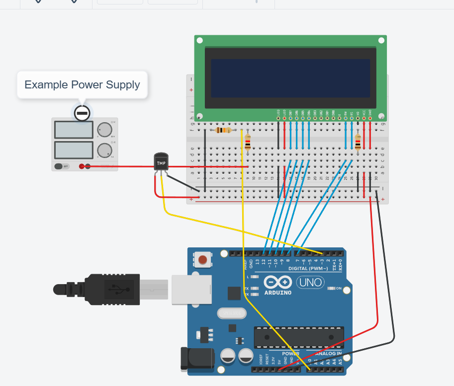

# Shiny Potato is the DIY Power Supply for Hobbyists #

Most linear power supplies for electronics hobbyists are either quite expensive or lack many features that would satisfy the requirements of a DIY electronics lab. This repo aims to add features to any DIY power supply of your choice. All you need to do is have a supply on hand and if desird an enclosure.

## Linear Regulator Based ##

Most cheap lab bench power supplies are switch mode power supplies. This introduces unwanted switching noise into your project and in some cases can even cause a test to fail or unpredicatable behavior. 
By using a Linear regulator it is both cost effective, stable and beginner friendly hence the decision to design a conrol system focused on liear regulators and supplies.

## Arduino Control ##

In order to achieve the most stability possible out of a budget DIY project an arduino UNO R3 will be used to give a Voltage readout, voltage regulator temperature monitoring and regulation by controlling a set of 12V fans.

You may choose to use and transistor of your choice so long as it can handle the current gain requirements of driving the fans and has arduino compatible switching voltages. For this design we used the TIP110 with a 150 Ohm current limiting resistor to ensure the gate current does not exceed 30 mA.

_______________________________________________________________

## Features ##

| Component   | Features                      		                           |
| ----------- | -------------------------------------------------------------- |
| LCD Display | Displays Voltage put out by the power supply and heat inside   |
|             | the power supply                                               | 
| Temp Sensor | measures heat inside the unit for regulation                   | 
| Volt Sensor | measures volatage to let the user know the voltage output      | 
| Fans        | Cools down the unit when it heats up too much                  | 

## Pinout List ##
| Component   | Pinout for named component			                           |
| ----------- | -------------------------------------------------------------- |
| LCD Display | 1k resistor to ground → VD, Pin 7 → RS, Pin 8 → RW,			   |
|             | K→GND Pin 9 → D4, Pin 10 → D5, Pin 11 → D6, Pin 12 → D7, A→VCC | 
| Temp Sensor | Vout → Pin 3                                                   | 
| Volt Sensor | Voltage Divider node A → A5                                    | 

## Pinout Image ##

## Block Diagram ##

# SAFETY DISCLAIMER #

## THIS PROJECT DEALS WITH POWER SUPPLIES ##

While the arduino itself is not dangerous, the power supply you choose may be dangerous. Do not attempt to dissasemble, open, or modify a power supply if you don't know what you're doing. Please ensure you have the proper training and qualifications before taking on certain types of power supplies that deal with high voltage. 

### Privacy ###

This project does not and will not collect your data. However, this repo is made available through GitHub therefore you are exposed to GitHub's data collection practices. 
